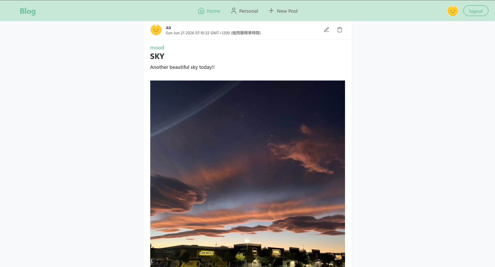
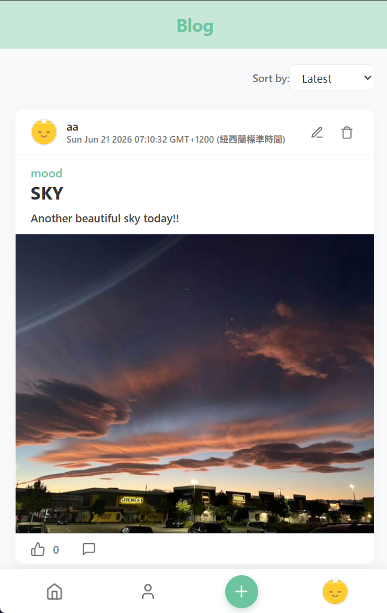
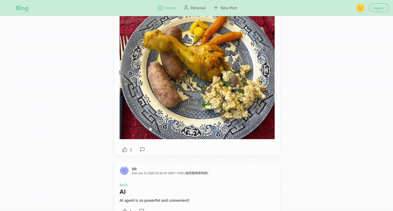
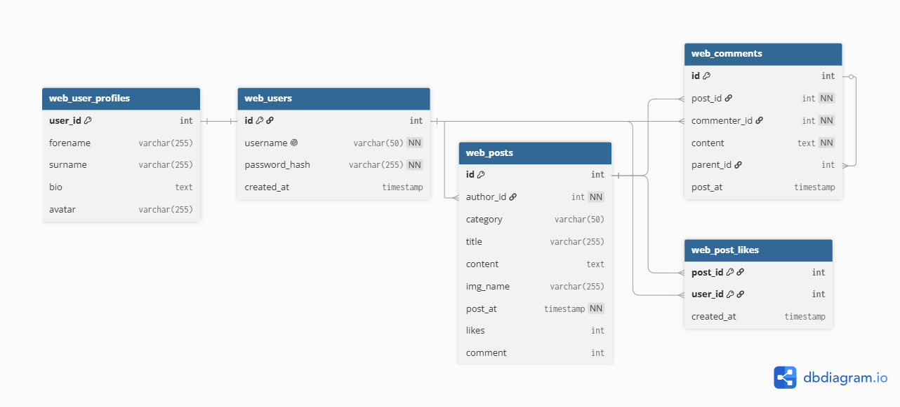

# 🎨Blog: Full-Stack Blogging & Social Platform

A responsive blog web application built from scratch. 
This platform supports user authentication, front-end interactions without full page reloads, a multi-level nested comment system, and an integrated WYSIWYG editor.

---
## 🛠️ Tech Stack

* **Backend:** Node.js, Express.js
* **Frontend:** JavaScript (ES6+), Handlebars.js (Templating Engine), HTML5, CSS3
* **WYSIWYG Library:** Quill.js
* **Database:** MariaDB

---
## 📸 Demo

### Home Page (RWD)



---
### Login Page


---
### Add & Delete Comment Demo


---
## 📁 Project Architecture & Router Structure

The backend follows a modular design, decoupling routing logic into specific domains for maintainability:

```text
├── public/                 # Static assets (client-side JS, CSS, images)
├── middleware/             # Authentication middleware for routes to use 
├── routes/                 # Express modular routers
│   ├── main-routes.js      # Publicly accessible routes
│   ├── account-routes.js   # Auth routes (Register, Login, Profile Edit/Delete)
│   ├── post-routes.js      # Article operations (CRUD, Likes, Image uploads)
│   └── comment-routes.js   # Nested comment operations (Create, Edit, Delete)
├── views/                  # Handlebars views and layouts
│   ├── account/            
│   ├── layouts/            # Two layouts for different url to use
│   ├── partials/           # (comment, navbarTop, navbarBottom, postModal) 
│   └── home.handlebars     # Home page
├── db/                     # Set up database and all the SQL query functions
│   ├── db-connect.js       # connect to database
│   ├── post-dao.js         # functions related to posts/comments/likes tables
│   └── user-dao.js         # functions related to users/user_profiles tables
├── .env.sample             # Template for required environment variables
├── *app.js*                # Main server entry point
├── init-db.sql             # initialize required schema in DB
└── package.json            # Dependencies and scripts
```

---
## 📊 Database Schema

---

## 🚀 Key Features

### 💬 Nested Comment System
* **Recursive Tree-Based Nesting:** Design a multi-level nested reply system (up to 2 levels: Comment ➡️ Reply ➡️ Sub-reply) by modeling comments as a **Tree Data Structure** (using self-referencing `parent_id` relations). 
    Use recursion during rendering to dynamically build, sort chronologically, and visually indent nested reply threads.* 
* **Flexible Moderation:** Comment authors can delete their own comments, while article authors hold full deletion privileges over any comment under their articles.
* **Collapsible UI:** Users can toggle the visibility of the comment section for a cleaner reading experience.

### 👤 User Account Management
* **Asynchronous Username Validation:** Use **AJAX / Fetch API** to check username availability instantly during registration without reloading the page.
* **Client-Side Password Matching:** Visual indicators ensure passwords match before enabling form submission.
* **Secure Authentication:** Passwords are securely **hashed and salted** before database storage. 
* **Custom Avatars & Profiles:** Users can choose predefined avatars, add bios, and update or delete their accounts (supports Cascading Deletes for user data).

### 📝 Article Management
* **WYSIWYG Rich Text Editing:** Integrated **Quill.js** to allow heading styles, bold, italic, underline, and list formatting without HTML exposure.
* **Image Upload Support:** Built-in capability to upload and attach a featured image per article.
* **Asynchronous Sorting (No Reload):** Client-side/AJAX sorting by Article Title, Username, or Date.
* **Interaction System:** Secure like/unlike mechanism preventing duplicate likes per user, with live total counts.

### 🔒 Security Practices

* **SQL Injection Prevention:**  Uses **Prepared Statements**.
* **Credential Protection:** Passwords are never stored in plaintext (Salted + Hashed).
* **Environment Isolation:** Sensitive details are managed via `.env` files and excluded from version control.

---

## ⚙️ Installation & Setup

### Prerequisites
* Node.js (v16.x or higher)
* npm
* MariaDB Server installed and running

### 1. Clone the repository
```bash
git clone https://github.com/yourusername/your-repo-name.git
cd your-repo-name
```

### 2. Install dependencies
```bash
npm install
```

### 3. Environment Configuration
Copy the provided sample environment file and populate it with your configuration:
```bash
cp .env.sample .env
```
Open `.env` and fill in your values:
```env
EXPRESS_PORT=3000
SESSION_SECRET=your_super_secret_session_key

# MariaDB Connection Details
DB_HOST=localhost
DB_USER=your_mariadb_user
DB_PASS=your_mariadb_password
DB_NAME=devblog_db
```

### 4. Init your database
```bash
mysql -u your_mariadb_user -p < init-db.sql
```
(Note: Since MariaDB is a drop-in replacement for MySQL, it utilizes the same mysql command-line client.)

### 5. Run the application
```bash
# To start the server
node app.js
```
The server will start, and you can access it at `http://localhost:3000/`.

---
## 📝 Credits & Acknowledgments
* **[Quill.js](https://quilljs.com/)** - A powerful, open-source WYSIWYG editor built for the modern web. Used under the MIT License to power the rich text creation and editing capabilities for articles within this platform.

---
## Author
* **Ching-shing (Deeumiya) Huang**

## License
this project is licensed under the **MIT License**.
